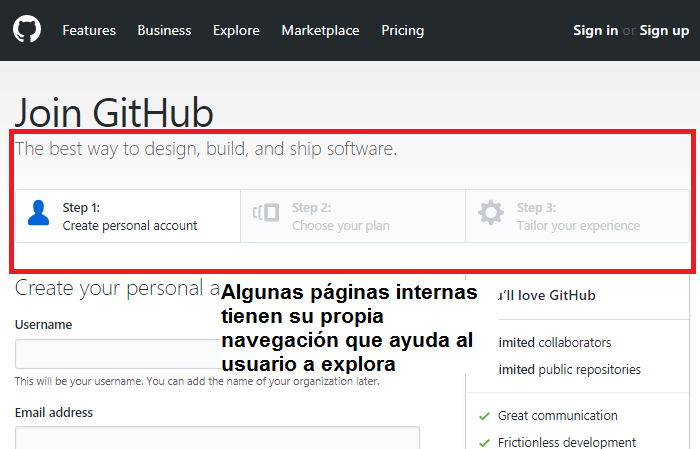

## 1. Sobre la web de *Laboratoria*: explica qué partes conforman el UX y qué partes el UI

UX

La imagen principal muestra a 3 mujeres con birrete dos de ellas sonriendo, transmiten satisfacción de
haber logrado su objetivo.

Utilizan  las  palabras transforma y transformación en el mensaje de bienvenida la cuál forma parte de
la misión de Laboratoria. Esto, genera curiosidad e invita a conocer mas acerca de lo que hace Laboratoria
para conseguir éste objetivo.

La barra de contacto se mantiene fija lo cuál te da confianza en preguntar en el momento en que surja
cualquier duda y acceder facilmente y  al utilizar redes sociales que la gran mayoria utiliza ahorra la acción de generar una nueva cuenta

En la segunda sección Reiteran en el boton de POSTULA para redireccionar  a la  convocatoria y asi confirmar si después de la información que te proporcionaron en esta sección te ha convencido  

Las secciones: Nuestro Impacto,Aliados Regionales, Reconocimientos y Presencia en medios generan confiabilidad y dan a conocer la eficacia del programa así como el alcance que tienen como organización

UI

Fondo blanco en todo el documento
Botones:  

ESTUDIANTES.  Fondo amarillo y letras negras posicionado en la esquina superios izq. de la pantalla
              Redirecciona a la convocatoria para postular a Laboratoria.

EMPRESAS. Fondo blanco con letras y borde amarillo
          Redirecciona a la pagina dónde las empresas se suscriben para contratar talento o incribirse a
          distintos cursos.

Logo "Laboratoria" centrado entre los botones ESTUDIANTES Y EMPRESAS

Barra de contacto fija
Iconos: Facebook
        Twitter
        E-mail Compartir con un amigo
 Sección postula tiene el texto centrado y nuevamente un boton:
 COMIENZA TU POSTULACIÓN: con fondo amarillo y letras negra el cual redirecciona a la convocatoria de laboratoria
 TESTIMONIO Background de Sandra Azabache
 Talento tech Conoce Nuestras Egresadas CONOCE NUESTRO TALENTO Redirecciona a la página de Talento de Laboratoria
 TESTIMONIO Empresa Crowdbotics
 Corporate training CONOCE NUESTROS CURSOS  Redirecciona a la pagina dónde las empresas se suscriben para contratar talento o incribirse a distintos cursos.
 Testimonio Carla Tomache Gerente comercial Financier Oh!
 NUESTRO IMPACTO
 Barack Obama
 ALIADOS REGIONALES
 RECONOCIMIENTOS
 PRESENCIA EN MEDIOS
 BLOG
 Footer con misión de Laboratoria background negro Contactanos, Trabaja con nosotros y Blog

## 2. Identifica los elementos de y navegación de: *Github*
**GLOBAL**

**LOCAL**

FACETADA

FILTRADA

CONTEXTUAL

INLINE

SUPLEMENTARIA

## 3. Crea un *sketch* para la herramienta del dashboard de Laboratoria.
