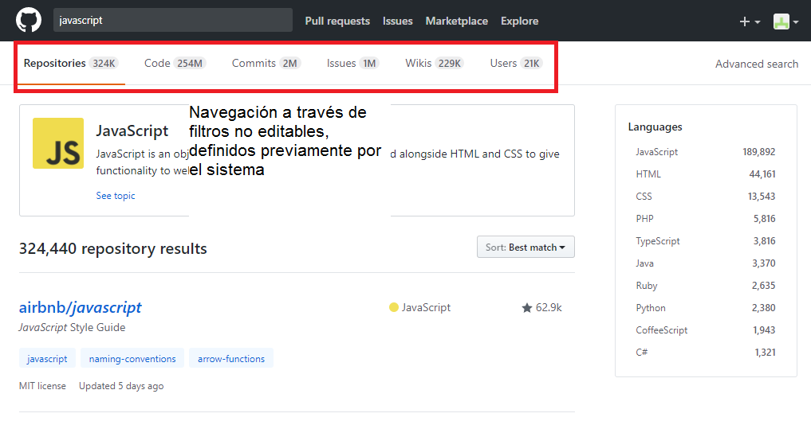

## 1. Sobre la web de *Laboratoria*: explica qué partes conforman el UX y qué partes el UI

**UX**

- La imagen principal muestra a 3 mujeres con birretes dos de ellas sonriendo, transmiten satisfacción de haber logrado su objetivo.

- Utilizan  las  palabras transforma y transformación en el mensaje de bienvenida la cuál forma parte de la misión de Laboratoria. Esto, genera curiosidad e invita a conocer mas acerca de lo que hace Laboratoria
para conseguir éste objetivo.

- La barra de contacto se mantiene fija lo cuál te da confianza en preguntar en el momento en que surja cualquier duda y acceder facilmente y  al utilizar redes sociales que la gran mayoria utiliza ahorra la acción de generar una nueva cuenta

- En la segunda sección Reiteran en el boton de POSTULA para redireccionar  a la  convocatoria y asi confirmar si después de la información que te proporcionaron en esta sección te ha convencido el postulare.

- En los testimoniales de  Sandra Azabache, Empresa Crowdbotics, Carla Tomache Gerente comercial Financier Oh!y Barack Obama conoce laboratoria incrementan la confianza el programa así como la eficacia

- Las secciones: Nuestro Impacto,Aliados Regionales, Reconocimientos y Presencia en medios generan confiabilidad y dan a conocer la eficacia del programa así como el alcance que tienen como organización

- En el blog y el Footer proporcionan mas información así como accesibilidad para mantenerse en contacto con el usuario.

**UI**

- Fondo blanco en todo el documento

- Botones:  

  ESTUDIANTES.  Fondo amarillo y letras negras posicionado en la esquina superios izq. de la pantalla
  Redirecciona a la convocatoria para postular a Laboratoria.

  EMPRESAS. Fondo blanco con letras y borde amarillo
  Redirecciona a la pagina dónde las empresas se suscriben para contratar talento o incribirse a distintos cursos.

  Sección postula tiene el texto centrado y nuevamente un boton:
  COMIENZA TU POSTULACIÓN: con fondo amarillo y letras negra el cual redirecciona a la convocatoria de laboratoria  

  Talento tech Conoce Nuestras Egresadas
  CONOCE NUESTRO TALENTO Con fondo amarillo y letras negras.Redirecciona a la página de Talento de Laboratoria     

  Corporate training
  CONOCE NUESTROS CURSOS  Con fondo amarillo y letras negras. Redirecciona a la pagina dónde las empresas se suscriben para contratar talento o incribirse a distintos cursos.   

- Logo "Laboratoria" centrado entre los botones ESTUDIANTES Y EMPRESAS

- Barra de contacto fija
  Iconos:
          Facebook
          Twitter
          E-mail Compartir con un amigo

- Background con imagen completa y texto centrado sobrepuesto.       
  TESTIMONIO  de Sandra Azabache

  TESTIMONIO Empresa Crowdbotics

  TESTIMONIO Carla Tomache Gerente comercial Financier Oh!

  TESTIMONIO Barack Obama conoce laboratoria.

- Cifras
 NUESTRO IMPACTO Datos porcentuales de laboratoria con la misma tipografía de los botones.

- Iconos
  Centrados y en tabla en cada uno de las siguientes secciones:
  ALIADOS REGIONALES
  RECONOCIMIENTOS
  PRESENCIA EN MEDIOS

- BLOG.
  Texto centrado y links que redireccionan a distintos articulos del blog en caja gris

- Footer
 Con misión de Laboratoria background negro y letras blancas
 Enlaces: Contactanos, Trabaja con nosotros y Blog

## 2. Identifica los elementos de y navegación de: *Github*

**GLOBAL**

**FACETADA**

**FILTRADA**

**CONTEXTUAL**

**INLINE**

**SUPLEMENTARIA**

## 3. Crea un *sketch* para la herramienta del dashboard de Laboratoria.

